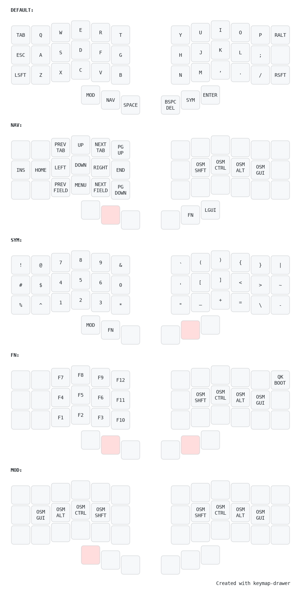

A 5-layer (technically 6-layer) keymap for 42-key keyboard with 6 thumb cluster keys that features oneshot mod layer.

# Oneshot Mod Layer
Huge thanks to [Callum's keymap](https://github.com/callum-oakley/qmk_firmware/tree/master/users/callum) for inspiration.

Oneshot mod layer removes the unreliability of mod-tap at the expense of one more key press.
The problem I faced with Callum's keymap is that you have to be very careful in when you release mod keys for pressing shortcuts that need to have multiple modifiers enabled.
The main idea I kept in my head when designing this keymap is to just press keys in the right order without thinking about releasing them, and it should just work.
Idea itself is pretty simple, but it took a lot of small details to make it convenient to use (and behave according to intuition) which made it more complex than usual keymap.
I have not seen these extensions in the wild, so I think it is worth sharing.

## Design requirements
- No timings
- No delays
- No thinking about which key to release first
- As intuitive as possible
  - But because there is more moving parts it may be more difficult to understand
- All shortcuts that are possible to press on regular full size keyboard are possible to press using this keymap as well (but some may be not as convenient to use as others)
- Multi-OS
  - No KC_CUT, KC_COPY, KC_PASTE, etc key codes
  - Separate mod layer for macOS (still TODO)
- Copy, Paste, Cut are one-hand shortcuts (on left side because I am right-handed and usually have mouse in it), are easily accessible and are easy to repeat
- No need to throw away Arrow keys muscle memory
  - Eases transition to VIM in future
- Avoid "specialized shortcut" keys, aka keys used only for one hyper specific action
  - I have made an except for browser navigation but that is not technically needed for the idea to work
- Symbols
  - Keep brackets together
- Avoid QK_REPEAT_KEY
- It is possible to use various letter from european alphabets accessible via right alt

## Description

### Oneshot Mod Layer

The keymap features custom implementation of oneshot mod keys and oneshot MOD layer key that work together.
Oneshot mod key implementation is mostly reused Callum's implementation with some additions.

- Each homerow modifier key is oneshot
  - If another key is pressed while modifier key is held, modifier key is considered used and modifier will be turned off when modifier key is released
  - If no key is pressed while mod was held the modifier is queued waiting for next key press
- Separate oneshot mod layer
  - Homerow mods are accessible via this layer
  - FN and NAV layers have separate sets of homerow mods that use the same oneshot mod implementation but do not interact with mod layer
  - Layer oneshot also works the same way as mod oneshot
    - If another key is pressed while layer key is held, layer key is considered used and layer will be turned off when layer key is released
    - If no key is pressed while the MOD layer key was held the layer is queued waiting for next key press
  - All keys of MOD layer except mods are transparent
- All 4 homerow mods and layer work together
  - Modifiers do not interfere with each other: pressing another modifier will not fire or queue previously pressed modifiers
  - Releasing modifier key doesn't turn of the mod layer if one modifier key is pressed
    - In other words only the last released modifier key disables mod layer
  - While MOD layer key is held queued modifiers do not get used and stay active
  - When MOD layer key is released all active modifiers are released as well
  - MOD layer is split into 2 layers: left and right
    - When modifier key on one side is pressed the other side is disabled
- Home row mod state is reset if NAV or FN layer key is pressed

All of this results into an intuitive homerow mods system where you can just press layer, mods and a key without worrying which key to release first and without misfires of mod-tap 

### Other

Because of the size of the keyboard I managed to fit all symbols and numbers in the same layer which gave back one thumb cluster key.
Symbols are mostly placed arbitrarily, the only restriction for me was to keep brackets together, but can probably be optimized in some way.

CTRL + DELETE, CTRL + ENTER and CTRL + SPACE are all possible to press.
But CTRL + DELETE and CTRL + ENTER in my setup are usually pressed multiple times and CTRL + SPACE is not.
So I chose to place SPACE key near the MOD layer key, because pressing it requires raising the thumb from the MOD layer key
which is not true for the other side of keyboard where DELETE and ENTER keys are.

Most FN keys are located under the same number keys from symbol layer.

## Notable usage examples

Note: all examples here assume modifier keys on left side are used. Also, all examples (except the last one) are pressed using one hand

### CTRL + V
Note: MOD can be released at any step.
- Press and release MOD, press and release CTRL, press and release V
- Press MOD, press and release CTRL, release MOD, press and release V
- Press MOD, press and release CTRL, press and release V, release MOD

### CTRL + V multiple times
Note: While MOD is held, modifiers do not get used.
- Press MOD, press and release CTRL, press and release V multiple times, release MOD

### CTRL + C, CTRL + V

- Press MOD, press and release CTRL, press and release C, press and release V, release MOD  

### CTRL + SHIFT + ALT + F
Note: MOD can be released at any step.
- Press and release MOD, smash and release CTRL, SHIFT and ALT in any order, press and release F
- Press MOD, smash and release CTRL, SHIFT and ALT in any order, press and release F, release MOD

### CTRL + C, CTRL + SHIFT + V
Note: This one is not really useful but shows how mod layer works
- Press MOD, press and release CTRL, press and release C, press and release SHIFT, press and release V

### CTRL + L
Note: Because L is at the place of one of the modifier keys, it would have been not possible 
to press when MOD layer key is held, 
but it was made easy by disabling the mod layer on the opposite side when modifier key is pressed
- Press MOD, press and release CTRL, press and release L, release MOD